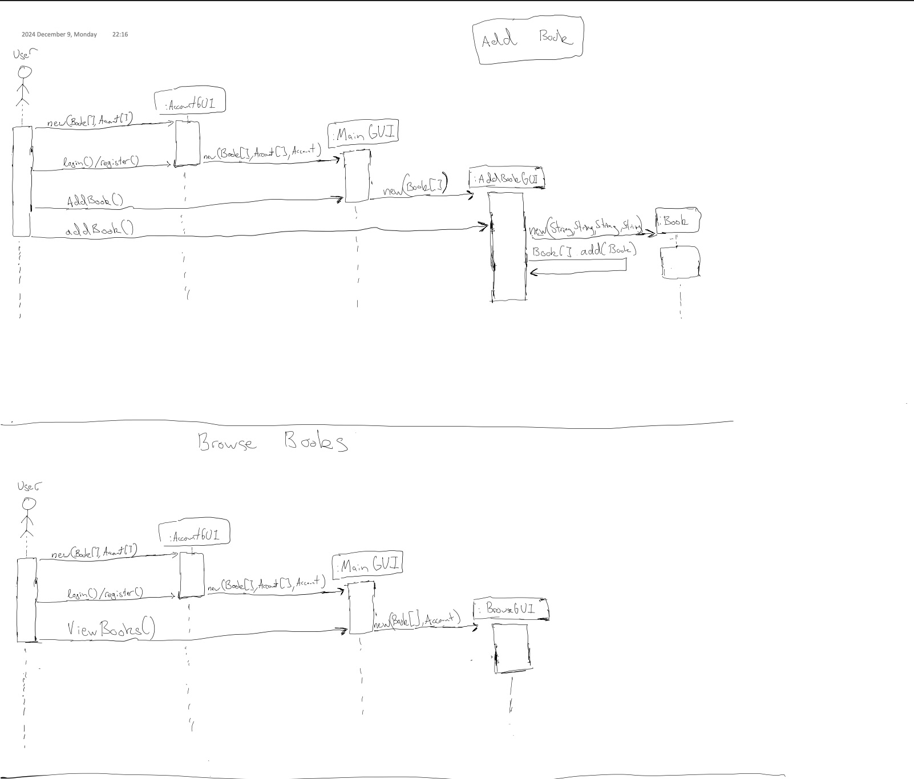

# Final Project OOP - Fall 2024

# Contributers:
[Daniel Brito](https://github.com/danny031103)

[Fox Zhang](https://github.com/foxzhang1224)

[Povilas Zinkevicius]()

# Project Overview
Design and implement a Library Management System with a GUI that enables users to access a library's resources.

# Project Link
[Github](https://github.com/foxzhang1224/OOPLibrary)

# Project Proposal 
[Link](https://docs.google.com/document/d/10YCZHaRu4rWZSDCgE_E0yFRvYMaokkx4pkGvDECP9Z8/edit?usp=sharing)

# Use Case Diagram

# Use Case Descriptions Table

# Class Diagram

# Sequence Diagrams

